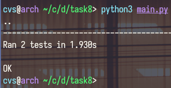

# Task 8 for Distributed Lab cryptograhy course
## Task goal:
#### Implement digital signature algorithm
## Workflow:
##### Implemented RSA asymmetric cryptosystem with encrypt/decrypt and digital\_sign/verify\_authenticity functions. Created tests for these fuctions.
##### Used libraries: **math, hashlib, Crypto.Util**
### Program execution example:
```sh
python3 main.py
```
### Output:

